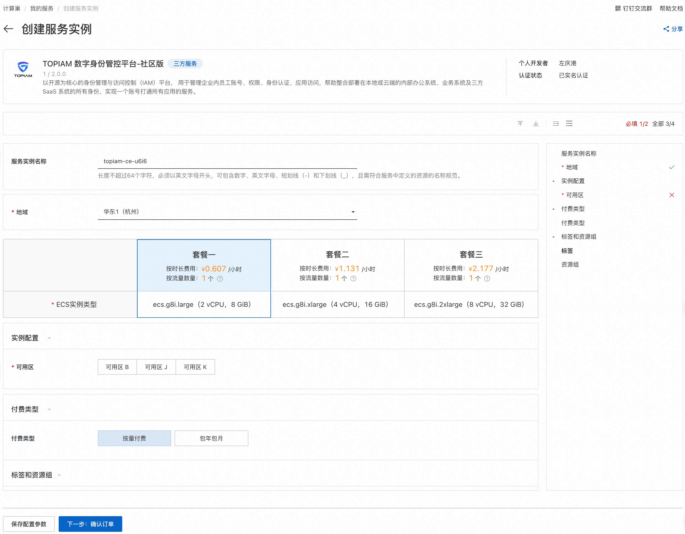
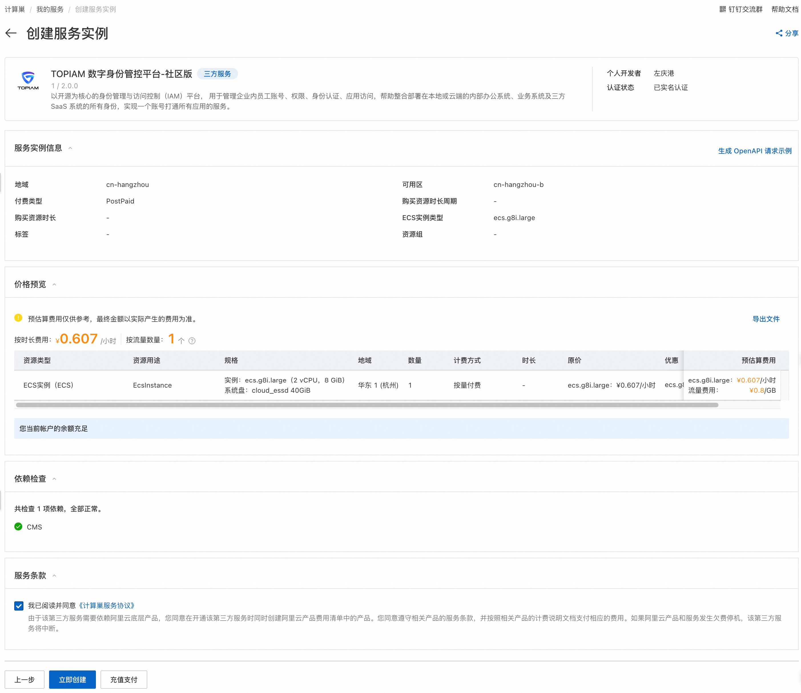
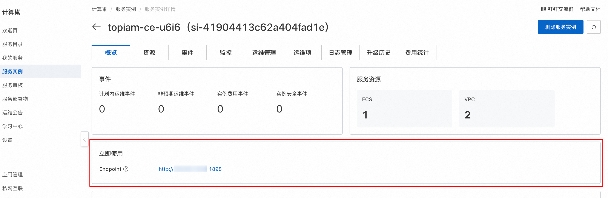
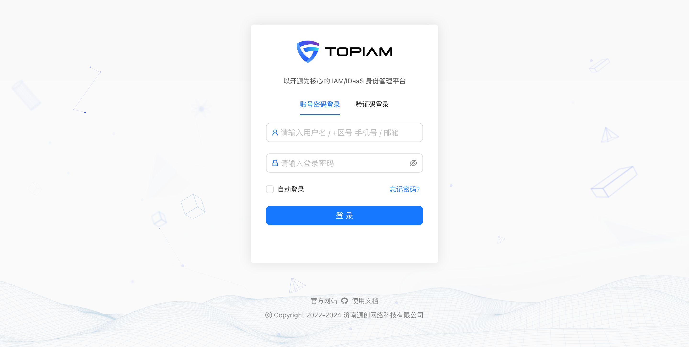

# 快速部署 TOPIAM

## 产品概述

TOPIAM 数字身份管控平台，以开源为核心的 IAM/IDaaS 身份管理平台，用于管理企业内员工账号、权限、身份认证、应用访问，帮助整合部署在本地或云端的内部办公系统、业务系统及三方 SaaS 系统的所有身份，实现一个账号打通所有应用的服务。

## 核心特性

- 提供统一组织信息管理，多维度建立对应关系，实现在一个平台对企业人员、组织架构、应用信息的高效统一管理。
- 支持钉钉、飞书、企业微信等身份源集成能力，实现系统和企业 OA 平台数据联动，以用户为管理基点，结合入职、离职、调岗、兼职等人事事件，关联其相关应用权限变化而变化，保证应用访问权限的安全控制。
- 支持多因素认证，行为验证码、社交认证，融合认证等机制，保证用户认证安全可靠。
- 支持微信、微博、QQ 等社交认证集成，使企业具有快速纳入互联网化认证能力。
- 支持 SAML2，OAuth2，OIDC，CAS，表单代填等认证协议及机制，实现单点登录功能，预配置大量 SaaS 应用及传统应用模板，开箱即用。
- 完善的安全审计，详尽记录每一次用户行为，使每一步操作有据可循，实时记录企业信息安全状况，精准识别企业异常访问和潜在威胁的源头。
- 提供标准 REST 和 SCIM2.0 接口轻松完成机构用户同步，实现企业对于账号生命周期的精细化管理。
- 开源、安全、自主可控。

## 计费说明

TOPIAM 数字身份管控平台在计算巢上的费用主要涉及：

- 所选vCPU与内存规格
- 磁盘容量
- 公网带宽

计费方式：

- 按量付费（小时）
- 包年包月

目前提供如下实例：

| 规格族 | vCPU与内存           | 系统盘 | 公网带宽         |
| --- |-------------------| --- |--------------|
| ecs.g8i.large | 通用型 2 vCPU，8 GiB  | ESSD云盘 40GiB | 按量付费带宽10Mbps |
| ecs.g8i.large | 通用型 4 vCPU，16 GiB | ESSD云盘 40GiB | 按量付费带宽10Mbps |
| ecs.g8i.large | 通用型 8 vCPU，32 GiB | ESSD云盘 40GiB | 按量付费带宽10Mbps |

如需更多规格、其他服务（如集群高可用性要求、企业级支持服务等），请联系我们 [support@topiam.cn](mailto:support@topiam.cn)。

预估费用在创建实例时可实时看到。

## 部署架构

TOPIAM数字身份管控平台-社区版是单机部署架构。

## RAM账号所需权限

TOPIAM数字身份管控平台服务需要对ECS、VPC等资源进行访问和创建操作，若您使用RAM用户创建服务实例，需要在创建服务实例前，对使用的RAM用户的账号添加相应资源的权限。添加RAM权限的详细操作，请参见[为RAM用户授权](https://help.aliyun.com/document_detail/121945.html)
。所需权限如下表所示。

| 权限策略名称                          | 备注                         |
|---------------------------------|----------------------------|
| AliyunECSFullAccess             | 管理云服务器服务（ECS）的权限           |
| AliyunVPCFullAccess             | 管理专有网络（VPC）的权限             |
| AliyunROSFullAccess             | 管理资源编排服务（ROS）的权限           |
| AliyunComputeNestUserFullAccess | 管理计算巢服务（ComputeNest）的用户侧权限 |
| AliyunCloudMonitorFullAccess    | 管理云监控（CloudMonitor）的权限     |

## 部署流程

1. 单击 [部署链接](https://computenest.console.aliyun.com/service/instance/create/cn-hangzhou?type=user&ServiceName=TOPIAM%20数字身份管控平台-社区版)，进入服务实例部署界面。

2. 选择目标ECS实例，点击下一步：确认订单。
   

3. 点击立即创建，等待服务实例创建完成。
   

4. 服务实例创建成功后，进入服务实例详情页。在概览页可获取TOPIAM登录信息。
   

5. 点击访问地址，登录TOPIAM数字身份管控平台。
   

## 联系我们

欢迎访问[TOPIAM 官网](https://aliyun.com)了解更多信息。

联系邮箱：[support@topaim.cn](mailto:support@topaim.cn)

社区版开源地址：[https://github.com/topiam/eiam](https://github.com/topiam/eiam)

扫码关注微信公众号，技术博客、活动通知不容错过：

